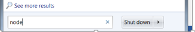

	**FullStack TO00BS65**

**Node.js Workshop 0**

**After completing this workshop, student knows how to:**

=========================================================
- Write a simple HelloWorld –program in Node.js
- Run Node.js on a local computer
- Create a simple web server and output data to the browser

*Create a new folder called WS0 for these assignments. Place all your code there.*

# **Run Node.js on a local computer**

1. If you wish to run Node.js on a local computer find Node from Windows Start menu.

1. You should find two program files: Node.js and Node.js command prompt. 

   Let’s run Node.js at first. It will open up a JavaScript console in which you can type in commands. Try typing the lines shown in the image below. This is actually the same thing as the JavaScript console we have used earlier in Chrome and Firefox; a way to try out different code snippets and see the response on the fly.

     

1. Write a for loop which counts from 0 to 100 and outputs something on the screen?

1. Next Try running the Node.js command prompt from Windows Start menu. It will open a command prompt for you, in which you can run scripts from a file. To do so, create a file called “helloworld.js” using Notepad or editor of your choice and type in the same lines of code which were used previously to output some text. Then type in the console “node helloworld.js” and press enter. The file should be run and the output displayed on the console.

   

1. There are many IDE’s and editors to choose from when developing locally. In this course, I’m using Microsoft Visual Studio Code for local editing. 

# **Create a simple web server and output the data to the browser**

1. Use the code below to create a simple webserver with Node.js. Point your browser to the URL and see how it works.

   
   *Note: The server URL in Cloud9 is displayed on the console. On local machines, it is 127.0.0.1.*

1. Add some text to the response by using response.write() function. The code has to be between the lines 6 and 9. Why is that?

1. Change the content-type of your response to text/html. Write some HTML-tags to the response sent to the user, for example <h1>Hello world</h1>. Can you see the output?

1. Output a simple HTML table from Node.js. Table could be something like below:

|Name|Address|City|
| :- | :- | :- |
|Matti Meikäläinen|Timotie 1, as 10|Tampere|
|Maija Virtanen|Asematie 12|Kiljava|

1. ` `Add styles and some links to the table
1. What use can you think of for a web server created with Node.js?

**Create simple web server with routes**
#
*Routes are a way to add more functionality to a web app in Node.js.*

1. Create a new file “helloroutes.js” containing a simple web server outputting “hello world”.
1. ` `When this works, modify the app a bit. Your app should respond to different URL’s by serving different content to the browser. This can be done by studying the request.url –parameter.

   if (request.url === “/helloworld”){

   // do something
   } 
   else if (request.url === “/helloworld”){

// do something
} 

For example: the url localhost:8081/helloworld should output the HTML formatted text “Hello world in HTML”.

However, the URL localhost:8081/homepage output the text “HOMEPAGE” to the browser.

Create some other routes too!

1. Create a GitHub-repository “R0314 MEAN” and upload the folder WS0 with completed Exercises to you GitHub-account.

|
![ref1]Laurea-ammattikorkeakoulu  

![ref1]Ratatie 22, 01300 Vantaa
|
![ref1]![ref1]Puhelin (09) 8868 7150

Faksi (09) 8868 7200
|
![ref1]![ref1]![ref1]jari.kovalainen@laurea.fi      

![ref1]www.laurea.fi
|Y-tunnus             1046216-1 Kotipaikka           Vantaa|
| :- | :- | :- | :- |
|||||

[ref1]: Aspose.Words.4ed4f339-01cb-4b9a-8c5a-a586ddaed06b.008.png
