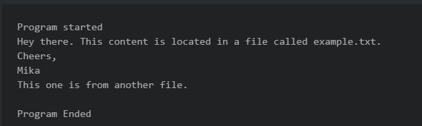
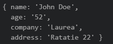

	**FullStack TO00BS65**

**Node.js Workshop 2: Working with Files and Directories**

**After completing this workshop, student knows how to:**

- Read Node.js API documentation in the Internet
- Understand synchronized and asynchronized code blocks
- Read, write and delete text files 
- Read, write, create and remove directories
- Utilize Routes with files
- Process JSON files

*Create a new folder called WS2 for these assignments. Place all your code there.*

# **Create the apps below and see the difference. Try to understand why do they work differently? You can find the code here:** 

Program A: Read file using non-blocking, event driven way

Program B: Read file using the traditional blocking way

# **Get familiar with the Node.js API documentation** 

All the modules contained in Node.js core are listed in [Node.js API documentation](https://nodejs.org/dist/latest-v4.x/docs/api/). This should be your main source for help when trying to know how a specific function works or whether Node.js can perform something you’re interested in doing.

Take a moment to browse the API and find some of the functions we’ve covered so far in the workshops, such as console.log and [readFile](https://nodejs.org/dist/latest-v10.x/docs/api/fs.html#fs_fs_readfile_path_options_callback) / [readFileSync](https://nodejs.org/dist/latest-v10.x/docs/api/fs.html#fs_fs_readfilesync_path_options). 

In the todays tasks, you are asked to code some programs using a specific function. Use API documentation to find the function and try to figure out how it works.

# **Read, write and delete text files** 

1. You should know how to read a text file and display the contents on console. Try this on your own, create a program “readingfiles.js” that will read one text file display the contents on the console. 

1. Modify the program so, that it will read two text files, and output both on the console.

1. Writing files is just as easy. It is done using the fs.writeFile –function. Create a file “combiningfiles.txt” and utilize writeFile –function to it, so that it will write the text files of two files into a single new file. See the syntax and how to use writeFile from Node.js API.

1. When this works, try adding the string “I wrote this!” at the top and the bottom of the new text file. Hint: see API for “append” related file functions.**

1. Create a program “deletingfiles.js” which will delete the textfile you created on task 4. Use the unlink –function. See how to use it from Node.js API.
1. Create program “readingdir.js” Try to use readdir() function. Can you output a directory content to the console/browser?
1. Create program “directories.js” Try mkdir and rmdir; when writing the files in step 3 first create a new folder called “newdata” and then write the file there.

# **Serve files to the browser**

1. You should know how to create a simple web server. Create a new app “routeswithactions.js” containing a simple web server outputting “hello world”.
1. Next modify the app so that it will serve different content to different routes. This can be done by studying the request.url –parameter
1. The route “/” should output the text “Nothing here to see” to the browser.

1. The route “*/frontpage*” will read a local HTML file “*frontpage.html”* and output the contents to the browser. (Sample HTML file available in <https://pastebin.com/mmN3YtKK>)

1. The route “*/contact”* will read a local HTML “*contact.html”* file and response the contents as HTML to browser (you can find sample file here: <https://pastebin.com/fH6UBa4g>)

1. The route “*/plaintext”* will read a local TXT file and output the contents as TXT to browser 

1. The route “*/json”* read a local JSON file “*sampledata.json*” and serve the contents as JSON type to browser (you can find sample file here: [sample JSON data](http://pastebin.com/raw/007hQiM4))

1. Notice that your app should send different ”Content-type” in HTTP header for all different responses. How will you achieve this?

# **Read and process JSON files locally** 

Use lecture notes and recording as a guide. There are plenty of [tutorials available in the Internet](https://www.codementor.io/nodejs/tutorial/how-to-use-json-files-in-node-js).

1. Online JSON formatters can make it easier to read API responses. Try this:  <https://jsonformatter.curiousconcept.com/>. If you save the data as a local file in VSCode, it will be nicely formatted as well.

1. Write a command line program which reads the “*sampledata.json*” data and do the following: 

   a) iterates through the data and displays name, age, company and address data on the console.

   

   b) same as on task a and surround the data with HTML-tags. 

c) Create a web server and output the data as HTML to the browser. 

# **Process JSON files** 

1. Create a node program “readingjson.js” which will read the [sample JSON data](http://pastebin.com/raw/007hQiM4) to a variable. Output the data to the console.
1. Create a new variable as below and add this new item to the JSON variable. Output the variable to the console to check it is added. Then write the new file to the disk as “dataset.json”. Open the file to confirm that the added object is in the file. 

   

1. Using JavaScript code delete one item from the JSON file. Output the data and to confirm. 

1. Output the JSON data to the web browser as plain text. Notice, that your response content-type needs to be set to “text/json”.

# **Push (upload) all the Exercises completed here to you GitHub-account.**

|
![ref1]Laurea-ammattikorkeakoulu  

![ref1]Ratatie 22, 01300 Vantaa
|
![ref1]![ref1]Puhelin (09) 8868 7150

Faksi (09) 8868 7200
|
![ref1]![ref1]![ref1]etunimi.sukunimi@laurea.fi      

![ref1]www.laurea.fi
|Y-tunnus             1046216-1 Kotipaikka           Vantaa|
| :- | :- | :- | :- |
|||||

[ref1]: Aspose.Words.b8bc9666-31f4-411b-93ad-b55180f436e3.017.png
